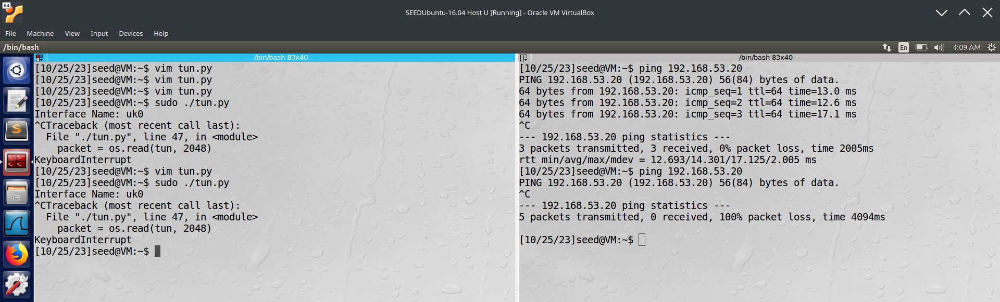

# [VPN Tunneling Lab](https://seedsecuritylabs.org/Labs_16.04/Networking/VPN_Tunnel/)

## 2 Task 1: Network Setup

Followed the instructions, and set-up the VM

  - https://seedsecuritylabs.org/Labs_16.04/Documents/SEEDVM_VirtualBoxManual.pdf

Create one VM, and Cloned to two more VMs.

Configured Static IP address


- Host U can communicate with VPN Server.


- VPN Server can communicate with Host V.


- Host U should not be able to communicate with Host V.


## 3 Task 2: Create and Configure TUN Interface

The Python code was depending on an external module called `scapy`. Since the Virtualbox did not have internet connection enabled, manually downloaded the `https://github.com/secdev/scapy/releases/tag/v2.5.0`, copied to inside the VM, extracted it into a directory, opened a Terminal, and ran the command `sudo python3 setup.py install` to install the `scapy` dependency.


## 3.1 Task 2.a: Name of the Interface

Edited the `tun` line highlighted in the below screenshot.


When running the `ip address` command, we are able to see the new interface name.


## 3.2 Task 2.b: Set up the TUN Interface

Added the two lines before the `while True` line.

`tun.py`

```python
#!/usr/bin/python3

import fcntl
import struct
import os
import time
from scapy.all import *

TUNSETIFF = 0x400454ca
IFF_TUN = 0x0001
IFF_TAP = 0x0002
IFF_NO_PI = 0x1000

# Create the tun interface
tun = os.open("/dev/net/tun", os.O_RDWR)
ifr = struct.pack('16sH', b'uk%d', IFF_TUN | IFF_NO_PI)
ifname_bytes = fcntl.ioctl(tun, TUNSETIFF, ifr)

# Get the interface name
ifname = ifname_bytes.decode('UTF-8')[:16].strip("\x00")
print("Interface Name: {}".format(ifname))

os.system("ip addr add 192.168.53.99/24 dev {}".format(ifname))
os.system("ip link set dev {} up".format(ifname))

while True:
    time.sleep(10)
```

After running the `ip address` command, we are able to see the ip address assigned and the link status shown as `UP`.


## 3.3 Task 2.c: Read from the TUN Interface

`tun.py`

```python
#!/usr/bin/python3

import fcntl
import struct
import os
import time
from scapy.all import *

TUNSETIFF = 0x400454ca
IFF_TUN = 0x0001
IFF_TAP = 0x0002
IFF_NO_PI = 0x1000

# Create the tun interface
tun = os.open("/dev/net/tun", os.O_RDWR)
ifr = struct.pack('16sH', b'uk%d', IFF_TUN | IFF_NO_PI)
ifname_bytes = fcntl.ioctl(tun, TUNSETIFF, ifr)

# Get the interface name
ifname = ifname_bytes.decode('UTF-8')[:16].strip("\x00")
print("Interface Name: {}".format(ifname))

os.system("ip addr add 192.168.53.99/24 dev {}".format(ifname))
os.system("ip link set dev {} up".format(ifname))

while True:
    # Get a packet from the tun interface
    packet = os.read(tun, 2048)
    if True:
        ip = IP(packet)
        print(ip.summary())
```


• On Host U, ping a host in the `192.168.53.0/24` network. What are printed out by the `tun.py` program? What has happened? Why?

The `tun interface` `192.168.53.99` is sending ICMP packets to the host queried `192.168.53.1`. This happens because when the host is pinged, the ICMP packet would be sent through the TUN interfaceas it is in the same subnet.

• On Host U, ping a host in the internal network `192.168.60.0/24`, Does tun.py print out anything? Why?

Nothing is printed when ping is invoked to the `192.168.60.1`. This is because the host is in an internal network, and the sent packets would not be passed to the tun interface. Since `tun.py` only prints when the packets are received, `tun.py` did not print anything in this scenario.

## 3.4 Task 2.d: Write to the TUN Interface

Please modify the tun.py code according to the following requirements:

##### After getting a packet from the TUN interface, if this packet is an ICMP echo request packet, construct a corresponding echo reply packet and write it to the TUN interface. Please provide evidence to show that the code works as expected.

`tun.py`

```python
#!/usr/bin/python3

import fcntl
import struct
import os
import time
from scapy.all import *

TUNSETIFF = 0x400454ca
IFF_TUN = 0x0001
IFF_TAP = 0x0002
IFF_NO_PI = 0x1000

# Create the tun interface
tun = os.open("/dev/net/tun", os.O_RDWR)
ifr = struct.pack('16sH', b'uk%d', IFF_TUN | IFF_NO_PI)
ifname_bytes = fcntl.ioctl(tun, TUNSETIFF, ifr)

# Get the interface name
ifname = ifname_bytes.decode('UTF-8')[:16].strip("\x00")
print("Interface Name: {}".format(ifname))

os.system("ip addr add 192.168.53.99/24 dev {}".format(ifname))
os.system("ip link set dev {} up".format(ifname))

def checkIcmpReq(bytesIn):
  pktIn = IP(bytesIn)
  # check for ICMP packet
  # check for echo request type
  if (
    ICMP in pktIn and
    pktIn[ICMP].type == 8
  ):
    return True
  return False

def createIcmpReply(bytesIn):
  pktIn = IP(bytesIn)
  ipOut = IP(src=pktIn.dst, dst=pktIn.src)
  pktOut = ipOut / pktIn.payload
  # set ICMP packet type as echo reply
  pktOut[ICMP].type = 0
  return bytes(pktOut)

while True:
    # Get a packet from the tun interface
    packet = os.read(tun, 2048)
    if checkIcmpReq(packet):
        os.write(tun, createIcmpReply(packet))
```

After running the modified code, and pinging the IP address, we can see that the ping receives the ICMP reply as expected by the code.


##### Instead of writing an IP packet to the interface, write some arbitrary data to the interface, and report your observation.

```python
#!/usr/bin/python3

import fcntl
import struct
import os
import time
from scapy.all import *

TUNSETIFF = 0x400454ca
IFF_TUN = 0x0001
IFF_TAP = 0x0002
IFF_NO_PI = 0x1000

# Create the tun interface
tun = os.open("/dev/net/tun", os.O_RDWR)
ifr = struct.pack('16sH', b'uk%d', IFF_TUN | IFF_NO_PI)
ifname_bytes = fcntl.ioctl(tun, TUNSETIFF, ifr)

# Get the interface name
ifname = ifname_bytes.decode('UTF-8')[:16].strip("\x00")
print("Interface Name: {}".format(ifname))

os.system("ip addr add 192.168.53.99/24 dev {}".format(ifname))
os.system("ip link set dev {} up".format(ifname))

def checkIcmpReq(bytesIn):
  pktIn = IP(bytesIn)
  # check for ICMP packet
  # check for echo request type
  if (
    ICMP in pktIn and
    pktIn[ICMP].type == 8
  ):
    return True
  return False

def createIcmpReply(bytesIn):
  pktIn = IP(bytesIn)
  ipOut = IP(src=pktIn.dst, dst=pktIn.src)
  pktOut = ipOut / pktIn.payload
  # set ICMP packet type as echo reply
  pktOut[ICMP].type = 0
  return bytes(pktOut)

while True:
    # Get a packet from the tun interface
    packet = os.read(tun, 2048)
    if checkIcmpReq(packet):
        os.write(tun, bytes("arbitrary data", encoding="UTF-8"))
```

After running the code again, the ping does not receive a valid ICMP reply, and hence shows `0 received` as shown in the below screenshot.



## 4 Task 3: Send the IP Packet to VPN Server Through a Tunnel

- Created `tun_server.py` in the Gateway VPN Server VM.

```python
#!/usr/bin/python3

from scapy.all import *

IP_A = "0.0.0.0"
PORT = 9090

sock = socket.socket(socket.AF_INET, socket.SOCK_DGRAM)
sock.bind((IP_A, PORT))

while True:
  data, (ip, port) = sock.recvfrom(2048)
  print("{}:{} --> {}:{}".format(ip, port, IP_A, PORT))
  pkt = IP(data)
  print("Inside: {} --> {}".format(pkt.src, pkt.dst))
```


- Renamed `tun.py` to `tun_client.py`, and appended the UDP Client program in the appropriate places.

```python
#!/usr/bin/python3

import fcntl
import struct
import os
import time
from scapy.all import *

TUNSETIFF = 0x400454ca
IFF_TUN = 0x0001
IFF_TAP = 0x0002
IFF_NO_PI = 0x1000

# Create the tun interface
tun = os.open("/dev/net/tun", os.O_RDWR)
ifr = struct.pack('16sH', b'uk%d', IFF_TUN | IFF_NO_PI)
ifname_bytes = fcntl.ioctl(tun, TUNSETIFF, ifr)

# Get the interface name
ifname = ifname_bytes.decode('UTF-8')[:16].strip("\x00")
print("Interface Name: {}".format(ifname))

os.system("ip addr add 192.168.53.99/24 dev {}".format(ifname))
os.system("ip link set dev {} up".format(ifname))

def checkIcmpReq(bytesIn):
  pktIn = IP(bytesIn)
  # check for ICMP packet
  # check for echo request type
  if (
    ICMP in pktIn and
    pktIn[ICMP].type == 8
  ):
    return True
  return False

def createIcmpReply(bytesIn):
  pktIn = IP(bytesIn)
  ipOut = IP(src=pktIn.dst, dst=pktIn.src)
  pktOut = ipOut / pktIn.payload
  # set ICMP packet type as echo reply
  pktOut[ICMP].type = 0
  return bytes(pktOut)

SERVER_IP = "192.168.60.1"
SERVER_PORT = 9090

# Create UDP socket
sock = socket.socket(socket.AF_INET, socket.SOCK_DGRAM)

while True:
    # Get a packet from the tun interface
    packet = os.read(tun, 2048)
    if True:
        # Send the packet via the tunnel
        sock.sendto(packet, (SERVER_IP, SERVER_PORT))
```


**Testing**. Run the tun server.py program on VPN Server, and then run tun client.py on `Host U`. To test whether the tunnel works or not, ping any IP address belonging to the 192.168.53.0/24 network. What is printed out on VPN Server? Why?


The print statements in the `tun_server.py` indicated that the VPN Server received the ping packets sent from the Host U, but since there were no reply packets sent back the ping command did not show any response.

##### Our ultimate goal is to access the hosts inside the private network 192.168.60.0/24 using the tunnel. Let us ping Host V, and see whether the ICMP packet is sent to VPN Server through the tunnel. If not, what are the problems?


We try to ping 192.168.60.0/24 from the Host U, but as the above screenshot shows, we do not see anything printed in the terminal.

This is expected, as we have not yet added the route information for the tunnel that was created.

##### You need to solve this problem, so the ping packet can be sent through the tunnel. This is done through routing, i.e., packets going to the 192.168.60.0/24 network should be routed to the TUN interface and be given to the tun client.py program.

We modify the `tun_client.py` program as given below.

```python
#!/usr/bin/python3

import fcntl
import struct
import os
import time
from scapy.all import *

TUNSETIFF = 0x400454ca
IFF_TUN = 0x0001
IFF_TAP = 0x0002
IFF_NO_PI = 0x1000

# Create the tun interface
tun = os.open("/dev/net/tun", os.O_RDWR)
ifr = struct.pack('16sH', b'uk%d', IFF_TUN | IFF_NO_PI)
ifname_bytes = fcntl.ioctl(tun, TUNSETIFF, ifr)

# Get the interface name
ifname = ifname_bytes.decode('UTF-8')[:16].strip("\x00")
print("Interface Name: {}".format(ifname))

os.system("ip addr add 192.168.53.99/24 dev {}".format(ifname))
os.system("ip link set dev {} up".format(ifname))

os.system("ip route add 192.168.60.0/24 dev {}".format(ifname))

def checkIcmpReq(bytesIn):
  pktIn = IP(bytesIn)
  # check for ICMP packet
  # check for echo request type
  if (
    ICMP in pktIn and
    pktIn[ICMP].type == 8
  ):
    return True
  return False

def createIcmpReply(bytesIn):
  pktIn = IP(bytesIn)
  ipOut = IP(src=pktIn.dst, dst=pktIn.src)
  pktOut = ipOut / pktIn.payload
  # set ICMP packet type as echo reply
  pktOut[ICMP].type = 0
  return bytes(pktOut)

SERVER_IP = "192.168.60.1"
SERVER_PORT = 9090

# Create UDP socket
sock = socket.socket(socket.AF_INET, socket.SOCK_DGRAM)

while True:
    # Get a packet from the tun interface
    packet = os.read(tun, 2048)
    if True:
        # Send the packet via the tunnel
        sock.sendto(packet, (SERVER_IP, SERVER_PORT))
```

##### Please provide proofs to demonstrate that when you ping an IP address in the 192.168.60.0/24 network, the ICMP packets are received by tun server.py through the tunnel.

We ping again from the Host U, after modifying and running the `tun_client.py` code as above.

Now, we can see that the `tun_server.py` receives the ping packets, as shown in the below screenshot. The ping does not receive any reply, since the `tun_server.py` does not construct the reply packets yet, and is only printing the received packets to the STDOUT.


## 5 Task 4: Set Up the VPN Server

- Please modify `tun_server.py`, so it can do the following:

  - Create a TUN interface and configure it.

```python
#!/usr/bin/python3

import fcntl
import struct
import os
from scapy.all import *

TUNSETIFF = 0x400454ca
IFF_TUN = 0x0001
IFF_TAP = 0x0002
IFF_NO_PI = 0x1000
# The IP address is set so that it is on the same subnet
# This is not the IP address that is set on the tun_client
TUN_IP = "192.168.53.98"

# Create the tun interface
tun = os.open("/dev/net/tun", os.O_RDWR)
# The tun interface name should match the name set on the tun_client
ifr = struct.pack('16sH', b'uk%d', IFF_TUN | IFF_NO_PI)
ifname_bytes = fcntl.ioctl(tun, TUNSETIFF, ifr)

# Get the interface name
ifname = ifname_bytes.decode('UTF-8')[:16].strip("\x00")
print("Interface Name: {}".format(ifname))

# Set up the tun interface
os.system("ip addr add {}/24 dev {}".format(TUN_IP, ifname))
os.system("ip link set dev {} up".format(ifname))

IP_A = "0.0.0.0"
PORT = 9090

sock = socket.socket(socket.AF_INET, socket.SOCK_DGRAM)
sock.bind((IP_A, PORT))

while True:
  data, (ip, port) = sock.recvfrom(2048)
  print("{}:{} --> {}:{}".format(ip, port, IP_A, PORT))
  pkt = IP(data)
  print("Inside: {} --> {}".format(pkt.src, pkt.dst))
```

  - Get the data from the socket interface; treat the received data as an IP packet.

  - Write the packet to the TUN interface.

```python
#!/usr/bin/python3

import fcntl
import struct
import os
from scapy.all import *

TUNSETIFF = 0x400454ca
IFF_TUN = 0x0001
IFF_TAP = 0x0002
IFF_NO_PI = 0x1000
# The IP address is set so that it is on the same subnet
# This is not the IP address that is set on the tun_client
TUN_IP = "192.168.53.98"

# Create the tun interface
tun = os.open("/dev/net/tun", os.O_RDWR)
# The tun interface name should match the name set on the tun_client
ifr = struct.pack('16sH', b'uk%d', IFF_TUN | IFF_NO_PI)
ifname_bytes = fcntl.ioctl(tun, TUNSETIFF, ifr)

# Get the interface name
ifname = ifname_bytes.decode('UTF-8')[:16].strip("\x00")
print("Interface Name: {}".format(ifname))

# Set up the tun interface
os.system("ip addr add {}/24 dev {}".format(TUN_IP, ifname))
os.system("ip link set dev {} up".format(ifname))

IP_A = "0.0.0.0"
PORT = 9090

sock = socket.socket(socket.AF_INET, socket.SOCK_DGRAM)
# bind the socket to the specified port
sock.bind((IP_A, PORT))

while True:
  data, (ip, port) = sock.recvfrom(2048)
  print("{}:{} --> {}:{}".format(ip, port, IP_A, PORT))
  # treat the received data as an IP packet
  pkt = IP(data)
  os.write(tun, bytes(pkt))
```

#### Before running the modified tun server.py, we need to enable the IP forwarding. Unless specifically configured, a computer will only act as a host, not as a gateway. VPN Server needs to forward packets between the private network and the tunnel, so it needs to function as a gateway. We need to enable the IP forwarding for a computer to behave like a gateway. IP forwarding can be enabled using the following command:


##### **Testing**: If everything is set up properly, we can ping Host V from Host U. The ICMP echo request packets should eventually arrive at Host V through the tunnel. Please show your proof. It should be noted that although Host V will respond to the ICMP packets, the reply will not get back to Host U, because we have not set up everything yet. Therefore, for this task, it is sufficient to show (using Wireshark) that the ICMP packets have arrived at Host V.

On the VPN Server, the code is run with `sudo ./tun_server.py`

On the Host U,
  - in one Terminal, `sudo ./tun_client.py` is run

  - in another Terminal, `sudo ip route add 192.168.60.0/24 dev uk0 via 192.168.53.99` is run

On the Host V,
  - Wireshark packet capture is started

  - in a Terminal, `ping 192.168.60.101` command is run

The packet capture is observed as shown in below screenshot.


## 6 Task 5: Handling Traffic in Both Directions

- On the `Host V`, the default gateway needs to be set using the below command.


- `tun_client.py` file in Host U

```python
#!/usr/bin/python3

import fcntl
import struct
import os
import time
from scapy.all import *

TUNSETIFF = 0x400454ca
IFF_TUN = 0x0001
IFF_TAP = 0x0002
IFF_NO_PI = 0x1000

# Create the tun interface
tun = os.open("/dev/net/tun", os.O_RDWR)
ifr = struct.pack('16sH', b'uk%d', IFF_TUN | IFF_NO_PI)
ifname_bytes = fcntl.ioctl(tun, TUNSETIFF, ifr)

# Get the interface name
ifname = ifname_bytes.decode('UTF-8')[:16].strip("\x00")
print("Interface Name: {}".format(ifname))

os.system("ip addr add 192.168.53.99/24 dev {}".format(ifname))
os.system("ip link set dev {} up".format(ifname))

os.system("ip route add 192.168.60.0/24 dev {}".format(ifname))

def checkIcmpReq(bytesIn):
  pktIn = IP(bytesIn)
  # check for ICMP packet
  # check for echo request type
  if (
    ICMP in pktIn and
    pktIn[ICMP].type == 8
  ):
    return True
  return False

def createIcmpReply(bytesIn):
  pktIn = IP(bytesIn)
  ipOut = IP(src=pktIn.dst, dst=pktIn.src)
  pktOut = ipOut / pktIn.payload
  # set ICMP packet type as echo reply
  pktOut[ICMP].type = 0
  return bytes(pktOut)

SERVER_IP = "192.168.60.1"
SERVER_PORT = 9090

# Create UDP socket
sock = socket.socket(socket.AF_INET, socket.SOCK_DGRAM)

while True:
  # this will block until at least one interface is ready
  ready, _, _ = select.select([sock, tun], [], [])
  for fd in ready:
    if fd is sock:
      data, (ip, port) = sock.recvfrom(2048)
      pkt = IP(data)
      print("From socket <==: {} --> {}".format(pkt.src, pkt.dst))
      os.write(tun, bytes(pkt))

    if fd is tun:
      # Get a packet from the tun interface
      packet = os.read(tun, 2048)
      pkt = IP(packet)
      print("From tun ==>: {} --> {}".format(pkt.src, pkt.dst))
      # Send the packet via the tunnel
      sock.sendto(packet, (SERVER_IP, SERVER_PORT))
```

- `tun_server.py` file in Gateway Server

```python
#!/usr/bin/python3

import fcntl
import struct
import os
from scapy.all import *

TUNSETIFF = 0x400454ca
IFF_TUN = 0x0001
IFF_TAP = 0x0002
IFF_NO_PI = 0x1000
# The IP address is set so that it is on the same subnet
# This is not the IP address that is set on the tun_client
TUN_IP = "192.168.53.98"

# Create the tun interface
tun = os.open("/dev/net/tun", os.O_RDWR)
# The tun interface name should match the name set on the tun_client
ifr = struct.pack('16sH', b'uk%d', IFF_TUN | IFF_NO_PI)
ifname_bytes = fcntl.ioctl(tun, TUNSETIFF, ifr)

# Get the interface name
ifname = ifname_bytes.decode('UTF-8')[:16].strip("\x00")
print("Interface Name: {}".format(ifname))

# Set up the tun interface
os.system("ip addr add {}/24 dev {}".format(TUN_IP, ifname))
os.system("ip link set dev {} up".format(ifname))

IP_A = "0.0.0.0"
PORT = 9090
ip = "10.0.2.7"  # NAT Network IP for VPN Client
port = 10000 # dummy port to be replaced when values are read from socket

sock = socket.socket(socket.AF_INET, socket.SOCK_DGRAM)
# bind the socket to the specified port
sock.bind((IP_A, PORT))

while True:
  # this will block until at least one interface is ready
  ready, _, _ = select.select([sock, tun], [], [])
  for fd in ready:
    if fd is sock:
      data, (ip, port) = sock.recvfrom(2048)
      print("{}:{} --> {}:{}".format(ip, port, IP_A, PORT))
      # treat the received data as an IP packet
      pkt = IP(data)
      print("From socket <==: {} --> {}".format(pkt.src, pkt.dst))
      os.write(tun, bytes(pkt))

    if fd is tun:
      packet = os.read(tun, 2048)
      pkt = IP(packet)
      print("From tun ==>: {} --> {}".format(pkt.src, pkt.dst))
      sock.sendto(packet, (ip, port))
```


##### **Testing**: Once this is done, we should be able to communicate with Machine V from Machine U, and the VPN tunnel (un-encrypted) is now complete. Please show your wireshark proof using about ping and telnet commands. In your proof, you need to point out how your packets flow.

The `tun_server.py` is started on the Gateway Server VM


The `tun_client.py` is started on the Host U

To proof that the VPN tunnel works and trace the sequence of events, a single ping can be done from Host U to Host V with ping 192.168.60.101 as seen below.


Wireshark Packet capture is started on Host V

`ping 192.168.60.101` command is run on Host U


A similar process can be observed with telnet as well. `Host U` can telnet to `Host V` using `telnet 192.168.60.101` as shown below.


As ping and telnet from Host U to Host V can be performed successfully, it can be seen that the VPN tunnel is complete and enables Host U to communicate with Host V and vice versa.
