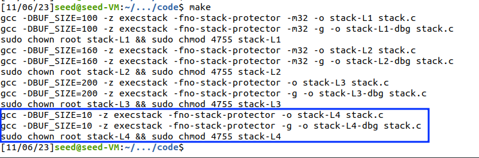
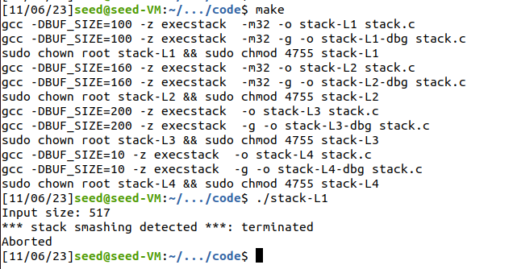

## [Buffer Overflow Attack Lab (Set-UID Version)](https://seedsecuritylabs.org/Labs_20.04/Software/Buffer_Overflow_Setuid/)

#### 2 Environment Setup

## 2.1 Turning Off Countermeasures

```sh
sudo sysctl -w kernel.randomize_va_space=0
```

```sh
sudo ln -sf /bin/zsh /bin/sh
```


#### 3 Task 1: Getting Familiar with Shellcode

## 3.1 The C Version of Shellcode


## 3.2 32-bit Shellcode

```sh
$ vim 3_2.s
$ nasm -f elf32 3_2.s -o 3_2.o
$ ld -m elf_i386 3_2.o -o 3_2
$ ./3_2 
```


## 3.3 64-Bit Shellcode

```sh
$ vim 3_3.s
$ nasm -f elf64 3_3.s -o 3_3.o
$ ld 3_3.o -o 3_3
$ ./3_3
```


## 3.4 Task: Invoking the Shellcode


#### 4 Task 2: Understanding the Vulnerable Program

We are trying to copy a string size of 517 to another string size of 100. Hence, the code has buffer overflow issue.


#### 5 Task 3: Launching Attack on 32-bit Program (Level 1)

## 5.1 Investigation

Type the commands

```
b bof
run
next
```


```
Legend: code, data, rodata, value
20	    strcpy(buffer, str);       
gdb-peda$ p $ebp
$1 = (void *) 0xffffcb08
gdb-peda$ p &buffer
$2 = (char (*)[100]) 0xffffca9c
gdb-peda$ p/d 0xffffcb08 - 0xffffca9c
$3 = 108
gdb-peda$ quit
```


Based on the values calculated using the GDB Debugger, and understanding of the Stack Layout, for the given process, we can calculate the approximate memory address where the attacker code should lie.

## 5.2 Launching Attacks

- The `shellcode` variable to the value available in the shellcode directory in the LabSetup zip file.

- The `offset` variable is assigned the value of `112 = (108 + 4)`, that is to correspond to the address of the `Return Address` in the stack.

- The `ret` variable is assigned the value of `ebp + 200` (200 is chosen randomly based on TRiAL and ERRoR), so that instruction in the badfile gets overflowed to the NOOP section of the stack.

- The `start` variable is assigned the value of `400` so that the `shellcode` (Attacker Code) does not lie at the end of the process stack.


After updating the four values in the `exploit.py` file, it is saved and executed to create the `badfile`.


After the `badfile` is created the `./stack-L1` program is executed.


#### Task 4: Launching Attack without Knowing Buffer Size (Level 2)

In this task, we assume that we only know range of buffer size `100 - 200 bytes`.


We are only allowed to get the location of the buffer using the Debugger.


```
Legend: code, data, rodata, value
20	    strcpy(buffer, str);       
gdb-peda$ p &buffer
$1 = (char (*)[160]) 0xffffca60
gdb-peda$ quit
```


In the exploit.py,

- the `shellcode` is placed at the end of the badfile, by calculating the offset from the total length of the file, from the last position of the file.

- Since we only know an approximate value of the total buffer size, we assume that the return address would be 200 or 400 bytes above the buffer.

- Instead of putting the Return Address at only position, like in the Previous Task, we put the Return Address at multiple locations since we do not know the exact location where the Return Address could be, because the size of the buffer is not known.


After creating the badfile, we run the program, and see that we are able to exploit the buffer overflow.


#### Task 5: Launching Attack on 64-bit Program (Level 3)

Similar to Task 3 `L1`, we create the `badfile`, run the `gdb stack-L3-dbg`

Type the commands

```
b bof
run
next
```

Based on the values calculated using the GDB Debugger, and understanding of the Stack Layout, for the given process, we can calculate the approximate memory address where the attacker code should lie.


```
Legend: code, data, rodata, value
20	    strcpy(buffer, str);       
gdb-peda$ p $rbp
$1 = (void *) 0x7fffffffd930
gdb-peda$ p &buffer
$2 = (char (*)[200]) 0x7fffffffd860
gdb-peda$ p/d 0x7fffffffd930 - 0x7fffffffd860
$5 = 208
gdb-peda$ quit
```

- The `shellcode` variable is updated to the 64bit shellcode value available in the shellcode directory in the LabSetup zip file.

- The `offset` variable is assigned the value of `112 = (208 + 8)`, that is to correspond to the address of the `Return Address` in the stack.

- The `ret` variable is assigned the value of `rbp + 200` (200 is chosen randomly based on TRiAL and ERRoR), so that instruction in the badfile gets overflowed to the NOOP section of the stack.

- The `start` variable is assigned the value of `100` so that the `shellcode` (Attacker Code) does not lie at the beginning of the process stack.


Similar to the `L1` Task, we run the `./exploit.py`, verify that the `badfile` is created, and run the `./stack-L3` program, we verify that the root shell is obtained using the Buffer Overflow attack.


#### Task 6: Launching Attack on 64-bit Program (Level 4)

In this task, we assume that we only know range of buffer size `10 bytes`.



Similar to the `L2` task, we find the address of the `rbp`.

Also, find the address of the `str` variable, since `buffer` size in this task is very small, and cannot completely hold the shellcode.


```
gdb-peda$ b bof
gdb-peda$ run
gdb-peda$ next

Legend: code, data, rodata, value
20	    strcpy(buffer, str);       
gdb-peda$ p $rbp
$1 = (void *) 0x7fffffffd930
gdb-peda$ p &buffer
$2 = (char (*)[10]) 0x7fffffffd926
gdb-peda$ p str
$3 = 0x7fffffffdd60 "Լ\252\252\252\252\377\377"
gdb-peda$ p &str
$4 = (char **) 0x7fffffffd918
gdb-peda$ quit
```

Now, we edit the `exploit.py` file as shown in the below screenshot.

- The `start` variable is assigned the value of `34` so that the `shellcode` (Attacker Code) lies at the beginning of the process stack.

- The `shellcode` variable is updated to the 64bit shellcode value available in the shellcode directory in the LabSetup zip file.

- The `offset` variable is assigned the value of `18` so that the `Return Address` lies in the beginning of the stack and to correspond to the address of the `Return Address` in the stack.


- The `ret` variable is assigned the value of `str + value` (value is obtained in a brute foce approach, with a shell script), so that instruction returns to the `str` in the main stack frame.


```sh
#!/bin/bash

value=-200

while true; do 
  value=$(( $value + 10 ))
  ./exploit.py $value 
  ./stack-L4 
done
```


We verify that the root shell is obtained using the brute force Buffer Overflow attack.

#### Tasks 7: Defeating dash’s Countermeasure

- Changing the Default Shell to `dash`


**Experiment**

###### without `setuid(0)` system call


Since the `sh` is pointed to `dash`, which is having the countermeasure, we are not able to obtain the root shell.

###### with `setuid(0)` system call


Updated the `setuid(0)` line to the beginning of the shellcode, and compiled and executed the program, we are able to observe that we obtained the root shell.


**Launching the L1 attack again**

Updated the `exploit.py` according to the `L1` task.


We are able to observe that we are successfully able to obtain the root shell, with `RUID = 0`.


#### Task 8: Defeating Address Randomization

Disabled the Address Space Randomization, according to the given instruction.


Ran the `./brute-force.sh`. Since under a 32bit system the stack only had 19 bits of entropy, we were able to do an exhaustive search and brute force the address locations.


#### Tasks 9: Experimenting with Other Countermeasures

### Task 9.a: Turn on the StackGuard Protection

- Repeated the `L1` attack with the address space randomization, and verified that the attack is still successful.


- Commented the first line in the `Makefile` to turn on the stackguard protection.


- Recompiled and launched the `./stack-L1` program again.




StackGuard Protection is a feature introduced by the C compiler which ensures the values do not get copied to the protected areas of the stack, as described in the above image.

### Task 9.b: Turn on the Non-executable Stack Protection

Replaced the `-z execstack` with `-z noexecstack` in the `Makefile`.


We observe that when executing the programs, we get Segmentation Fault error message.


**Defeating the non-executable stack countermeasure.** It should be noted that non-executable stack only makes it impossible to run shellcode on the stack, but it does not prevent buffer-overflow attacks, because there are other ways to run malicious code after exploiting a buffer-overflow vulnerability.
