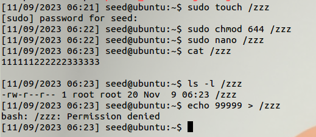
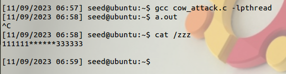
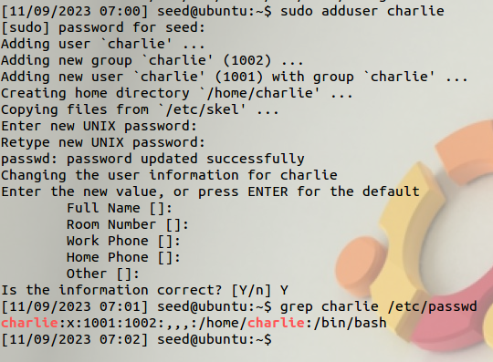
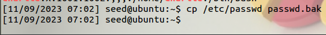
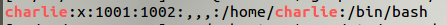
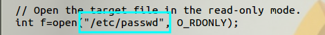
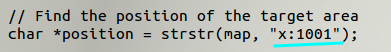
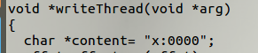
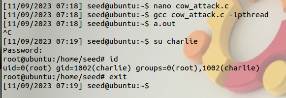

## [Dirty-COW Attack Lab](https://seedsecuritylabs.org/Labs_20.04/Software/Dirty_COW/)

#### 2 Task 1: Modify a Dummy Read-Only File

## 2.1 Create a Dummy File



## 2.2 Set Up the Memory Mapping Thread

- Downloaded the `cow_attack.c` from the Labsetup.zip file.

## 2.3 Set Up the `write` Thread

## 2.4 The `madvise` Thread

## 2.5 Launch the Attack

```sh
gcc cow_attack.c -lpthread
a.out
```



#### 3 Task 2: Modify the Password File to Gain the Root Privilege

- Adding a new user account called `charlie`.

```sh
sudo adduser charlie
grep charlie /etc/passwd
```



- Take a backup of the `/etc/passwd`.



- Edit the `cow_attack.c` as shown in below screenshot.



- Edit the `/zzz` to `/etc/passwd`



- Updated the `222222` to `x:1001`



- Updated the `******` to `x:0000`



- Compiled and Verified that `charlie`'s UID is now 0.


