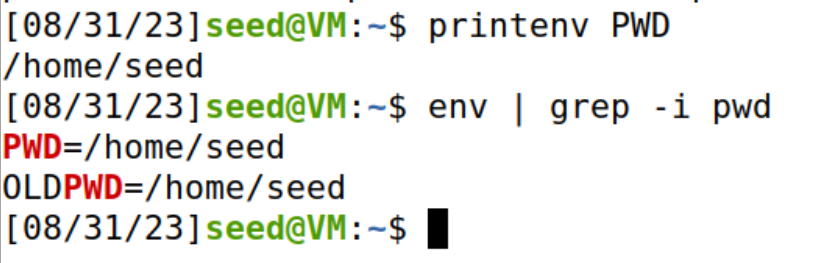
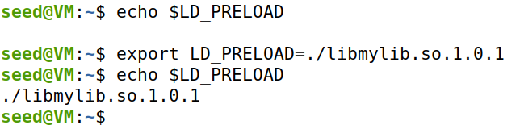

## [Environment Variable and Set-UID Program Lab](https://seedsecuritylabs.org/Labs_20.04/Software/Environment_Variable_and_SetUID/)


### Task 1: Manipulating Environment Variables

- Use `printenv` or `env` command to print out the environment variables. If you are interested in some particular environment variables, such as `PWD`, you can use `printenv PWD` or `env | grep PWD`.



- Use `export` and `unset` to set or unset environment variables. It should be noted that these two commands are not separate programs; they are two of the Bash’s internal commands (you will not be able to find them outside of Bash).


### Task 2: Passing Environment Variables from Parent Process to Child Process

**Step 1**. Please compile and run the following program, and describe your observation. The program can be found in the Labsetup folder; it can be compiled using `gcc myprintenv.c`, which will generate a binary called `a.out`. Let’s run it and save the output into a file using `a.out > file`.


**Step 2**. Now comment out the `printenv()` statement in the child process case (Line 1), and uncomment the `printenv()` statement in the parent process case (Line 2). Compile and run the code again, and describe your observation. Save the output in another file.


**Step 3**. Compare the difference of these two files using the diff command. Please draw your conclusion.

```sh
[08/31/23]seed@VM:~/Labsetup$ diff file file2
[08/31/23]seed@VM:~/Labsetup$ 
```

Based on the understanding of the `man fork` documentation, the environment variables do not change for the parent / child process.


### Task 3: Environment Variables and `execve()`

**Step 1**. Please compile and run the following program, and describe your observation.


**Step 2**. Change the invocation of `execve()`; describe your observation.


**Step 3**. Please draw your conclusion regarding how the new program gets its environment variables.

The global variable `environ` contains the list of environment variables available in the system.


The third parameter of the `execve` function determines the environment variables that would be available to the program.


### Task 4: Environment Variables and `system()`

- Please compile and run the following program to verify this.


### Task 5: Environment Variable and `Set-UID` Programs

**Step 1**. Write the following program that can print out all the environment variables in the current process.


**Step 2**. Compile the above program, change its ownership to root, and make it a Set-UID program.


**Step 3**. In your shell (you need to be in a normal user account, not the root account), use the `export` command to set the following environment variables.


-  Now, run the Set-UID program from Step 2 in your shell.

```sh
seed@VM:~/Labsetup$ ./foo
SHELL=/bin/bash
SESSION_MANAGER=local/VM:@/tmp/.ICE-unix/2038,unix/VM:/tmp/.ICE-unix/2038
QT_ACCESSIBILITY=1
COLORTERM=truecolor
XDG_CONFIG_DIRS=/etc/xdg/xdg-ubuntu:/etc/xdg
XDG_MENU_PREFIX=gnome-
GNOME_DESKTOP_SESSION_ID=this-is-deprecated
```

```sh
ANY_NAME=IJKL
```

```sh
GNOME_SHELL_SESSION_MODE=ubuntu
SSH_AUTH_SOCK=/run/user/1000/keyring/ssh
XMODIFIERS=@im=ibus
DESKTOP_SESSION=ubuntu
SSH_AGENT_PID=2002
GTK_MODULES=gail:atk-bridge
PWD=/home/seed/Labsetup
LOGNAME=seed
XDG_SESSION_DESKTOP=ubuntu
XDG_SESSION_TYPE=x11
GPG_AGENT_INFO=/run/user/1000/gnupg/S.gpg-agent:0:1
XAUTHORITY=/run/user/1000/gdm/Xauthority
GJS_DEBUG_TOPICS=JS ERROR;JS LOG
WINDOWPATH=2
HOME=/home/seed
USERNAME=seed
IM_CONFIG_PHASE=1
LANG=en_US.UTF-8
LS_COLORS=rs=0:di=01;34:ln=01;36:mh=00:pi=40;33:so=01;35:do=01;35:bd=40;33;01:cd=40;33;01:or=40;31;01:mi=00:su=37;41:sg=30;43:ca=30;41:tw=30;42:ow=34;42:st=37;44:ex=01;32:*.tar=01;31:*.tgz=01;31:*.arc=01;31:*.arj=01;31:*.taz=01;31:*.lha=01;31:*.lz4=01;31:*.lzh=01;31:*.lzma=01;31:*.tlz=01;31:*.txz=01;31:*.tzo=01;31:*.t7z=01;31:*.zip=01;31:*.z=01;31:*.dz=01;31:*.gz=01;31:*.lrz=01;31:*.lz=01;31:*.lzo=01;31:*.xz=01;31:*.zst=01;31:*.tzst=01;31:*.bz2=01;31:*.bz=01;31:*.tbz=01;31:*.tbz2=01;31:*.tz=01;31:*.deb=01;31:*.rpm=01;31:*.jar=01;31:*.war=01;31:*.ear=01;31:*.sar=01;31:*.rar=01;31:*.alz=01;31:*.ace=01;31:*.zoo=01;31:*.cpio=01;31:*.7z=01;31:*.rz=01;31:*.cab=01;31:*.wim=01;31:*.swm=01;31:*.dwm=01;31:*.esd=01;31:*.jpg=01;35:*.jpeg=01;35:*.mjpg=01;35:*.mjpeg=01;35:*.gif=01;35:*.bmp=01;35:*.pbm=01;35:*.pgm=01;35:*.ppm=01;35:*.tga=01;35:*.xbm=01;35:*.xpm=01;35:*.tif=01;35:*.tiff=01;35:*.png=01;35:*.svg=01;35:*.svgz=01;35:*.mng=01;35:*.pcx=01;35:*.mov=01;35:*.mpg=01;35:*.mpeg=01;35:*.m2v=01;35:*.mkv=01;35:*.webm=01;35:*.ogm=01;35:*.mp4=01;35:*.m4v=01;35:*.mp4v=01;35:*.vob=01;35:*.qt=01;35:*.nuv=01;35:*.wmv=01;35:*.asf=01;35:*.rm=01;35:*.rmvb=01;35:*.flc=01;35:*.avi=01;35:*.fli=01;35:*.flv=01;35:*.gl=01;35:*.dl=01;35:*.xcf=01;35:*.xwd=01;35:*.yuv=01;35:*.cgm=01;35:*.emf=01;35:*.ogv=01;35:*.ogx=01;35:*.aac=00;36:*.au=00;36:*.flac=00;36:*.m4a=00;36:*.mid=00;36:*.midi=00;36:*.mka=00;36:*.mp3=00;36:*.mpc=00;36:*.ogg=00;36:*.ra=00;36:*.wav=00;36:*.oga=00;36:*.opus=00;36:*.spx=00;36:*.xspf=00;36:
XDG_CURRENT_DESKTOP=ubuntu:GNOME
VTE_VERSION=6003
GNOME_TERMINAL_SCREEN=/org/gnome/Terminal/screen/7ad50313_a585_40ce_9e68_5b156eb0112f
INVOCATION_ID=20735a2caf314087b101710bcf7aca17
MANAGERPID=1798
GJS_DEBUG_OUTPUT=stderr
LESSCLOSE=/usr/bin/lesspipe %s %s
XDG_SESSION_CLASS=user
TERM=xterm-256color
LESSOPEN=| /usr/bin/lesspipe %s
USER=seed
GNOME_TERMINAL_SERVICE=:1.104
DISPLAY=:0
SHLVL=1
QT_IM_MODULE=ibus
XDG_RUNTIME_DIR=/run/user/1000
JOURNAL_STREAM=9:36768
XDG_DATA_DIRS=/usr/share/ubuntu:/usr/local/share/:/usr/share/:/var/lib/snapd/desktop
```

```sh
PATH=ABCD
```

```sh
GDMSESSION=ubuntu
DBUS_SESSION_BUS_ADDRESS=unix:path=/run/user/1000/bus
OLDPWD=/home/seed
_=./foo
seed@VM:~/Labsetup$
```

- Please check whether all the environment variables you set in the shell process (parent) get into the Set-UID child process. Describe your observation. If there are surprises to you, describe them.

The `PATH` and `ANY_NAME` environment variables are printed by the Set-UID program.

The `LD_LIBRARY_PATH` environment variable is not printed by the Set-UID program.


### Task 6: The PATH Environment Variable and Set-UID Programs

- Please compile the above program, change its owner to `root`, and make it a `Set-UID` program. Can you get this `Set-UID` program to run your own malicious code, instead of `/bin/ls`? If you can, is your malicious code running with the root privilege? Describe and explain your observations.


We can update the `PATH` variable so that the HOME directory is searched first instead of the `/bin` directory. Instead of the `ls` binary copied the shell binary, so that we can understand that the `Set-UID` program is run with the permissions.


### Task 7: The LD PRELOAD Environment Variable and Set-UID Programs

**Step 1**. First, we will see how these environment variables influence the behavior of dynamic loader/linker when running a normal program.

1. Let us build a dynamic link library. Create the following program, and name it mylib.c.

2. We can compile the above program using the following commands.


3. Now, set the LD PRELOAD environment variable.



4. Finally, compile the following program myprog, and in the same directory as the above dynamic link library.


**Step 2**. After you have done the above, please run myprog under the following conditions, and observe what happens.

- Make `myprog` a regular program, and run it as `a normal user`.


- Make `myprog` a Set-UID root program, and run it as `a normal user`.


- Make `myprog` a Set-UID root program, export the `LD_PRELOAD` environment variable again in `the root account` and run it.


- Make `myprog` a Set-UID `user1` program (i.e., the owner is `user1`, which is another user account), export the `LD_PRELOAD` environment variable again in a different user’s account (not-root user) (eg: `seed`) and run it.
    
    - Creating a new user account `user1`

    

    - Change the permissions of the program

    

    - export the environment variable and running the program

    


**Step 3**. You should be able to observe different behaviors in the scenarios described above, even though you are running the same program. You need to figure out what causes the difference. Environment variables play a role here. Please design an experiment to figure out the main causes, and explain why the behaviors in Step 2 are different.

//TODO

### Task 8: Invoking External Programs Using `system()` versus `execve()`

**Step 1**: Compile the above program, make it a root-owned Set-UID program. The program will use system() to invoke the command. If you were Bob, can you compromise the integrity of the system? For example, can you remove a file that is not writable to you?


**Step 2**: Comment out the system(command) statement, and uncomment the execve() statement; the program will use execve() to invoke the command. Compile the program, and make it a root-owned Set-UID. Do your attacks in Step 1 still work? Please describe and explain your observations.


### Task 9: Capability Leaking

- Compile the following program, change its owner to root, and make it a Set-UID program. Run the program as a normal user. Can you exploit the capability leaking vulnerability in this program? The goal is to write to the /etc/zzz file as a normal user.

- Created the `/etc/zzz` file.


- Changed the owner of the program to `root` and made it a `Set-UID` program.


