## [Return-to-libc Attack Lab](https://seedsecuritylabs.org/Labs_20.04/Software/Return_to_Libc/)

#### 2 Environment Setup

## 2.2 Turning Off Countermeasures

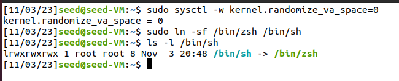

#### 3 Lab Tasks

## Task 1: Finding out the Addresses of libc Functions

We extract the provided ZIP file, run the `make` command.

We are able to see that `retlib.c` is compiled to a root owned Set-UID program called `retlib`.

We create a `badfile`, using `touch badfile` command, and start the GDB in quiet mode.

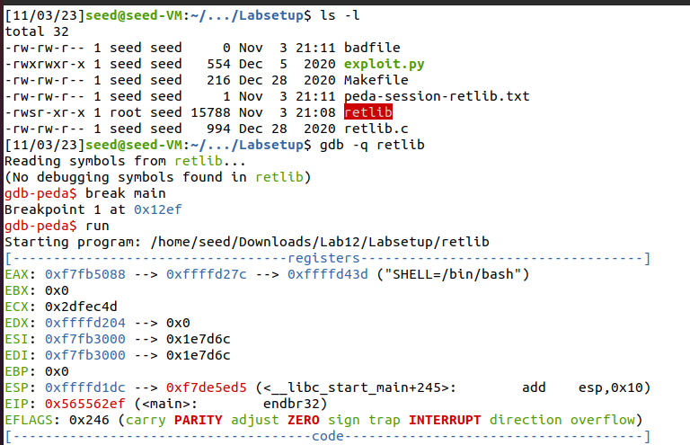

```
break main
run
```

We get the address of `system` and `exit` system calls using GDB.

```
Legend: code, data, rodata, value

Breakpoint 1, 0x565562ef in main ()
gdb-peda$ p system
$1 = {<text variable, no debug info>} 0xf7e0c360 <system>
gdb-peda$ p exit
$2 = {<text variable, no debug info>} 0xf7dfeec0 <exit>
gdb-peda$ quit
```

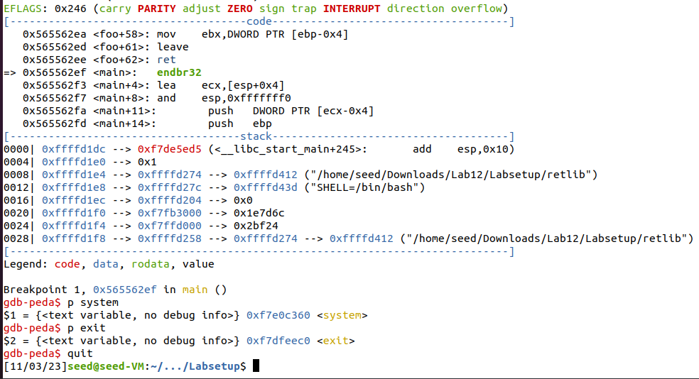

## Task 2: Putting the shell string in the memory

We create a new environment variable called `MYSHELL`.

```sh
export MYSHELL=/bin/sh
env | grep MYSHELL
```

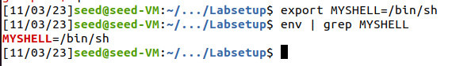

We create a C program in a file called `prtenv.c`, and compile it using the `gcc -m32 -g prtenv.c -o prtenv`.

`-m32` is used because the vulnerable program `retlib` is a 32 bit program, hence the address of `MYSHELL` environment variable should also correspond to a 32 bit program.

`-g` is used to enable the debugging symbols required for GDB.

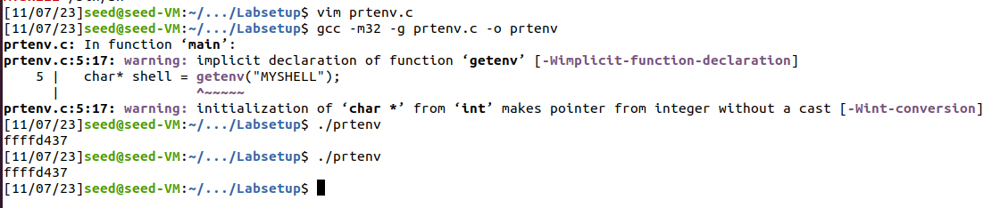

Since we had disabled the Address Space Randomization, executing the same program multiple times is showing the same address.

## Task 3: Launching the Attack

From the previous two tasks, we obtained:


|   | system call          | address    |
|---|----------------------|------------|
|   | system               | `0xf7e0c360` |
|   | exit                 | `0xf7dfeec0` |

|   | environment variable | address    |
|---|----------------------|------------|
|   | `/bin/sh`              | `0xffffd437`   |


Location of the `$ebp` needs to be calculated using gdb. We need to compile the `retlib` program by enabling the debugging symbols required for GDB. We do this by adding one line in the `Makefile` as shown in the below screenshot.

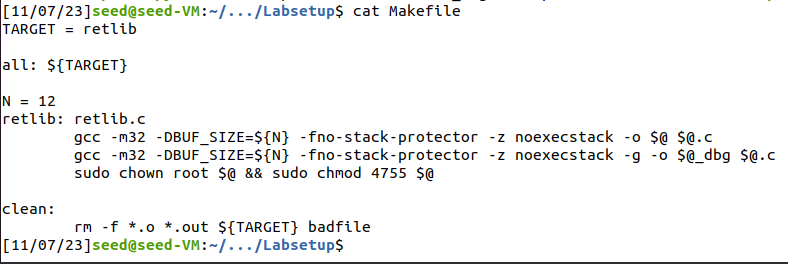

Then we open GDB using `gdb -q retlib_dbg` and type the commands:

```
b bof
run
next
```

```
Legend: code, data, rodata, value
21	    strcpy(buffer, str);   
gdb-peda$ p $ebp
$1 = (void *) 0xffffcd48
gdb-peda$ p &buffer
$2 = (char (*)[12]) 0xffffcd30
gdb-peda$ p/d 0xffffcd48 - 0xffffcd30
$3 = 24
gdb-peda$ quit
```

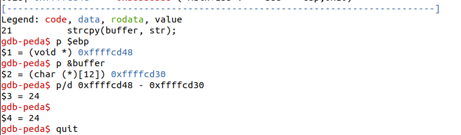

We obtained the position of the EBP Frame Pointer. We use this as the starting of the attacker code, and increment 4 bytes to place each of the required system calls and the appropriate arguments.

`exploit.py` is edited as shown in the below screenshot.

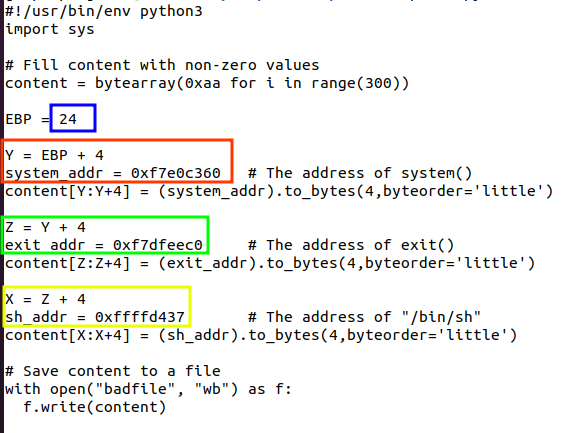


After editing the `exploit.py`, we construct the badfile and execute the `./retlib` program.

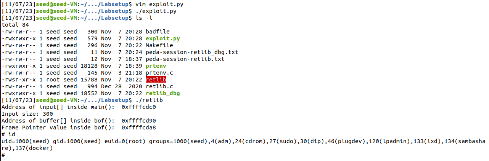

**Attack variation 1**

When the address of the `exit` function is commented from the `badfile`, we can observe that when the program is terminating, a segmentation fault happened, because the Return Address of the next program was not available.

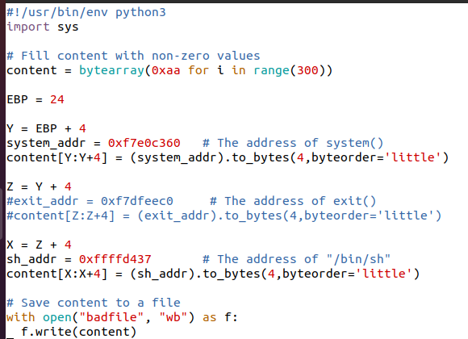

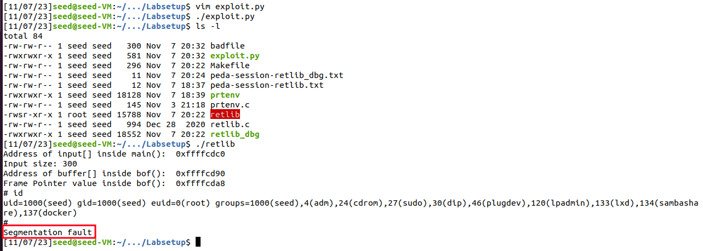

**Attack variation 2**

When the length of the program name is changed the offsets for the `/bin/sh` calculated and constructed in the `badfile` gets changed, and hence when the program tries to move to the particular instruction, it shows Command Not found message.

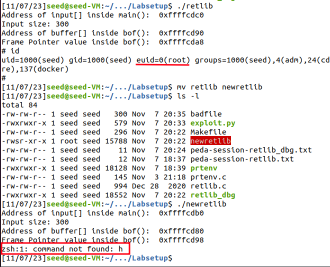
