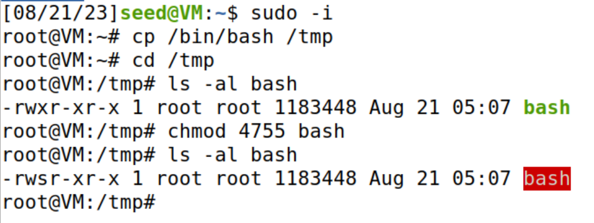

## [Set-UID Program Vulnerability Lab](https://web.ecs.syr.edu/~wedu/seed/Labs_12.04/Software/Set-UID/)

### Figure out why "passwd", "chsh", "su", and "sudo" commands need to be Set-UID programs. What will happen if they are not? If you are not familiar with these programs, you should first learn what they can do by reading their manuals. Please copy these commands to your own directory; the copies will not be Set-UID programs. Run the copied programs, and observe what happens.

If the passwd command was not Set-UID program, normal user would not be able to update their password without the root user permission.
Since the passwd is a Set-UID program, the program verifies the current password information and updates the /etc/passwd and /etc/shadow which is writable only by the root user. Root user is the Effective User Id with which the passwd program executes with. The effective user id is used for Access Control checks.

Similarly,

chsh program is used to Change the Default SHell of the current user. This information is required to be updated in the Seventh column of the /etc/passwd file.

sudo program needs to check the /etc/sudoers file, to know who are allowed to use the sudo command. This file is only readable by the root user, hence the program is required to be a Set-UID program.

su program needs to compare the password stored in /etc/shadow. This file is accessible only by the root user, hence the su program needs to be a Set-UID program.

I observe that copying the passwd program to the home directory causes the program to loose its Set-UID permissions.

### Run Set-UID shell programs in Linux, and describe and explain your observations.

#### Login as root, copy /bin/zsh to /tmp, and make it a set-root-uid program with permission `4755`.

#### Then login as a normal user, and run /tmp/zsh. Will you get root privilege? Please describe your observation.

Since ZSH is a Set-UID program when the program is executed the Effective User ID is the owner of the program. This is verified by using the id command as shown in the above screenshot.

#### Instead of copying /bin/zsh, this time, copy /bin/bash to /tmp, make it a set-root-uid program.

#### Run /tmp/bash as a normal user. will you get root privilege? Please describe and explain your observation.

When I copy bash and execute as normal user, I am not getting the root shell.

### (Setup for the rest of the tasks) As you can find out from the previous task, /bin/bash has certain built-in protection that prevent the abuse of the Set-UID mechanism. To see the life before such a protection scheme was implemented, we are going to use a different shell program called /bin/zsh. In some Linux distributions (such as Fedora and Ubuntu), /bin/sh is actually a symbolic link to /bin/bash. To use zsh, we need to link /bin/sh to /bin/zsh. The following instructions describe how to change the default shell to zsh.

### The PATH environment variable. 

#### Can you let this Set-UID program (owned by root) run your code instead of /bin/ls? If you can, is your code running with the root privilege? Describe and explain your observations.

- created `lsp.c` in the HOME directory.
- compiled the c program to a binary called `lsp`.

- updated the PATH variable to include the HOME directory as the first directory.
- Copied the `/bin/sh` program to HOME directory with filename `ls`.

- Executed the C Program.

####  Now, change /bin/sh so it points back to /bin/bash, and repeat the above attack. Can you still get the root privilege? Describe and explain your observations.

### The difference between system() and execve().

### Before you work on this task, please make sure that /bin/sh is pointed to /bin/zsh.

- Created `q5.c`
- Compiled it to q5 binary in the home directory.
- Updated the owner of the program, and set the Set-UID bit on the program.

#### Set q = 0 in the program. This way, the program will use system() to invoke the command. Is this program safe? If you were Bob, can you compromise the integrity of the system? For example, can you remove any file that is not writable to you? (Hint: remember that system() actually invokes /bin/sh, and then runs the command within the shell environment. We have tried the environment variable in the previous task; here let us try a different attack. Please pay attention to the special characters used in a normal shell environment).

#### Set q = 1 in the program. This way, the program will use execve() to invoke the command. Do your attacks in task (a) still work? Please describe and explain your observations.

- Updated the q5.c and recompiled the program.

